# Spesifikasi tool benchmark yang digunakan
- Operating System: Ubuntu 18.04
- Processor: Intel(R) Core(TM) i7-5500U CPU @ 2.40GHz
- RAM: 8GB
- K6 untuk melakukan pengukuran kinerja sistem dengan melakukan 10 ribu request konkuren

# Cara melakukan tes
1. Jalankan web server (Apache, Nginx, C++ dengan library libuv, serta NodeJS untuk static HTML file)
2. Jalankan munin-node service
3. Jalankan k6_script lewat terminal
```shell
$ k6 run --vus 500 --duration 30s k6_script.js
```
4. Tunggu k6 selesai melakukan testing
5. Untuk melihat hasil Response Time, dapat dilihat pada terminal k6 yang telah menyelesaikan testing
6. Dari rangkuman testing yang diberikan oleh k6, dapat dilihat rata-rata response time yang terjadi pada bagian "http_req_receiving"
6. Untuk melihat memory usage, buka http://localhost/munin/static/dynazoom.html?cgiurl_graph=/munin-cgi/munin-cgi-graph&plugin_name=localdomain/localhost.localdomain/memory&size_x=800&size_y=400&start_epoch=<WAKTU_MULAI>&stop_epoch=<WAKTU_SELESAI>
7. Dari grafik memory usage tersebut, dapat dilihat tingkat memory usage saat ketika testing dengan mengatur waktu mulai dan selesai testingnya


# Petunjuk instalasi/building dan cara menjalankan program
## C++
### Dependencies
1. libuv
You have to make sure CMake can find libuv library
```sh-session
brew install libuv
```

### Building
#### C++
```sh-session
cd c++
mkdir build
cd build
cmake ..
make
```

### Running the webserver
```sh-session
cd build
./simple-webserver <PORT>
```

## Node.js
### Running the webserver
```sh-session
cd js
node app.js
```
### Open http://localhost:3000/5.html for 500 bytes page and http://localhost:3000/20.html for 20kb bytes page

# Hasil Tes

|           |                     | Apache                        | NginX                         | Low Level Library (C++)       | High Level Library (NodeJS)   |
|-----------|---------------------|-------------------------------|-------------------------------|-------------------------------|-------------------------------|
| 500 bytes | response time (avg) | 16.82 ms                      | 15.44 ms                       | 2.92 ms                       | 108.47 ms                     |
|           | memory usage        | no significant diff. observed | no significant diff. observed | no significant diff. observed | no significant diff. observed |
| 20 kb     | response time (avg) | 19.04 ms                      | 25.34 ms                       | 2.74 ms                       | 126.83 ms                      |
|           | memory usage        | no significant diff. observed | no significant diff. observed | no significant diff. observed | no significant diff. observed |


# Screenshots
## Apache:
### 500b:  

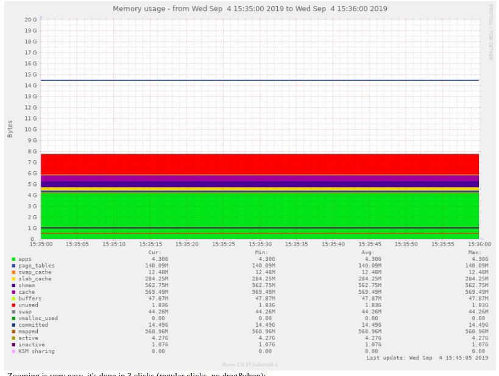

### 20kb:  
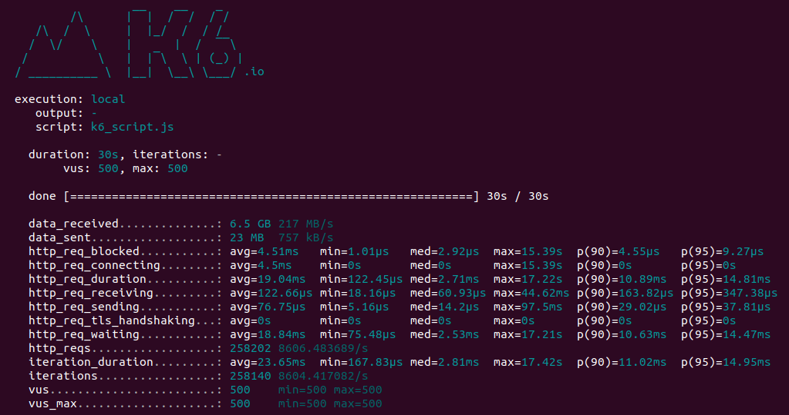


## Nginx:
### 500b:  
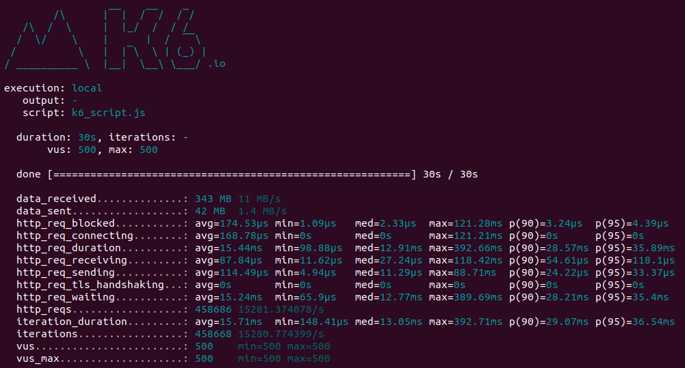
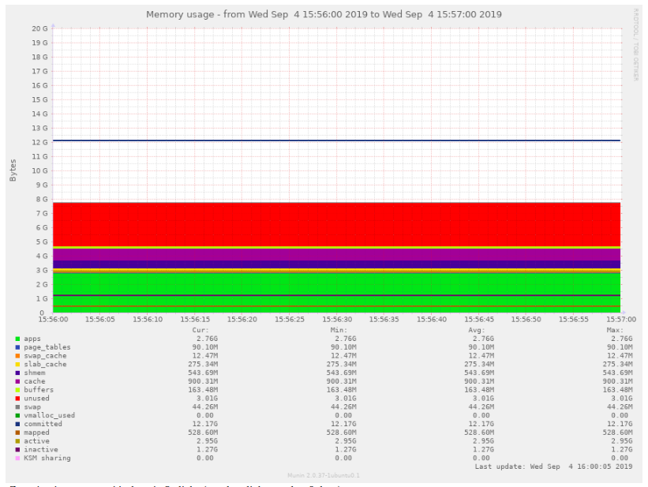

### 20kb:  
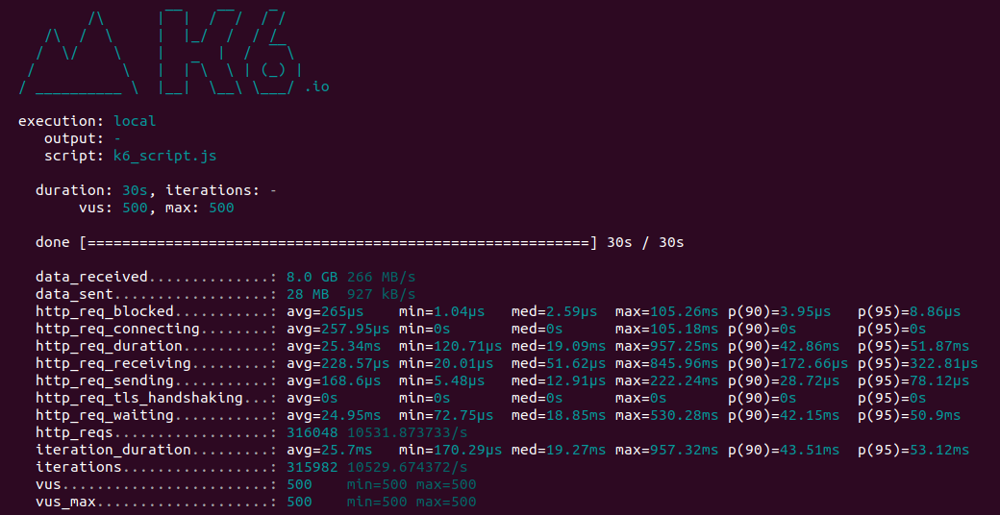
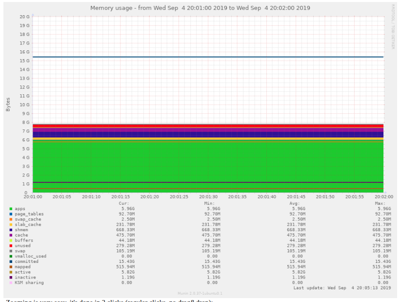

## C++:
### 500b:  
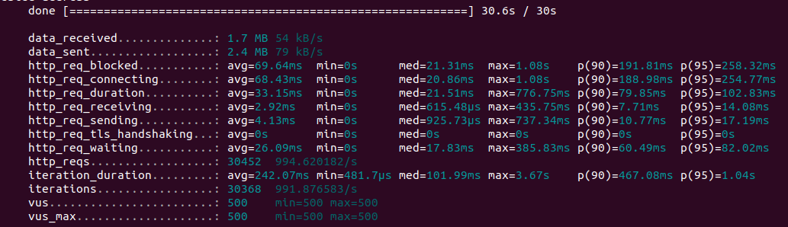
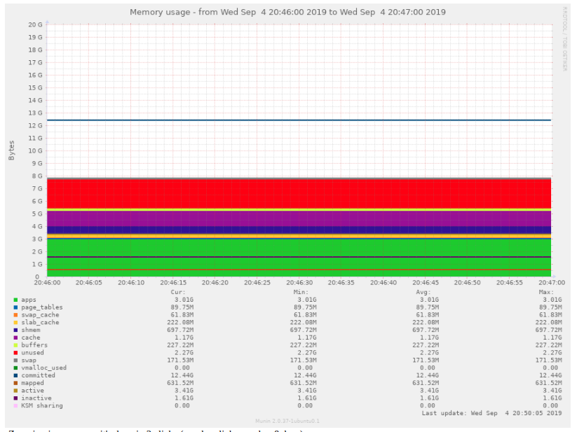

### 20kb:  
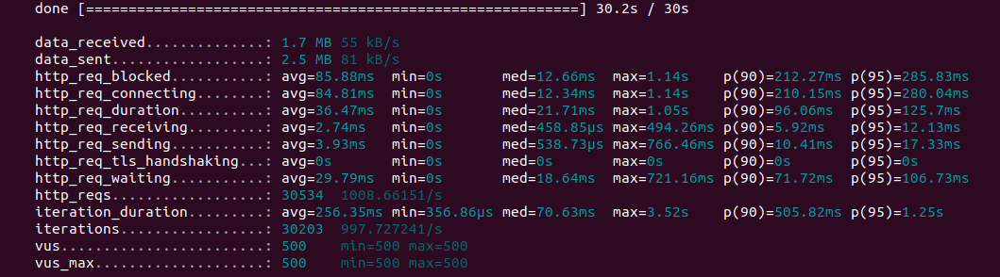
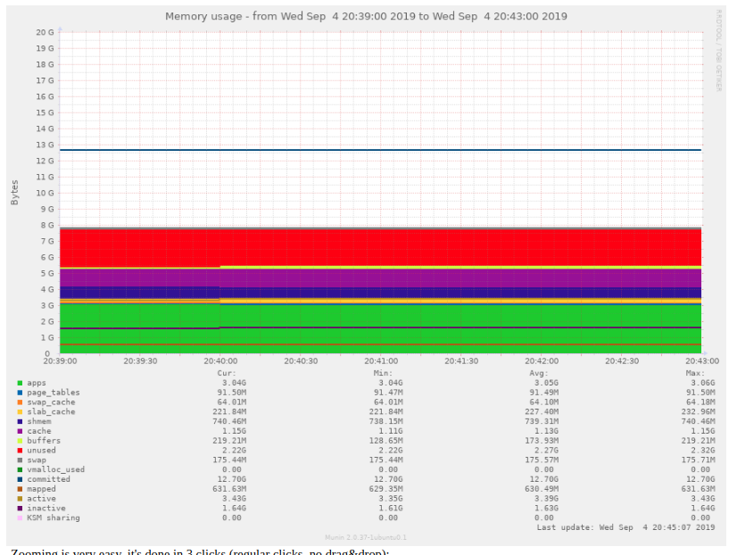

## NodeJS:
### 500b:  
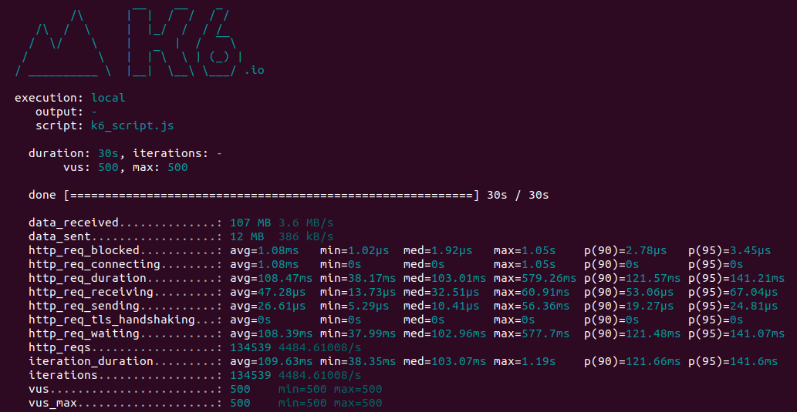
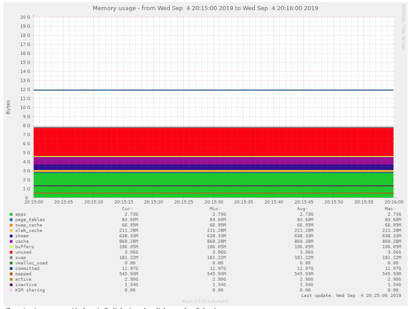

### 20kb:  
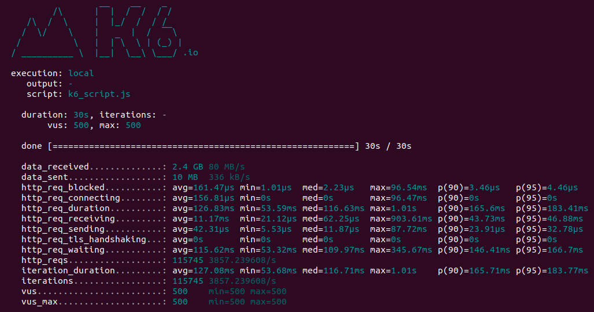

